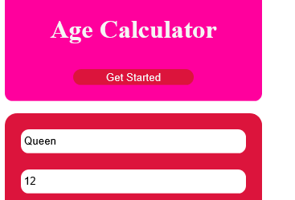

# AGE-CALCULATOR
 The age calculator is design for users to check the numbers of days they haved lived on earth.This application is one of my project as student programmer with the aim of mastering my html, CSS and java script.
## LIVE DEMO
https://raw.githack.com/QUEEN-YUSUF/AGE-CALCULATOR/main/index.html
## CONTENT OF THE CALCULATOR
 - Name
 - Age
 - submit
   though we have different Age calculator online this particular one is simple and easy to understand.
   ### How the calulator look like

#### you can reach me on 
-facebook https://www.facebook.com/profile.php?id=100006393993804
-twitter https://twitter.com/home?lang=en
instagram https://www.instagram.com/queenifitumi/
